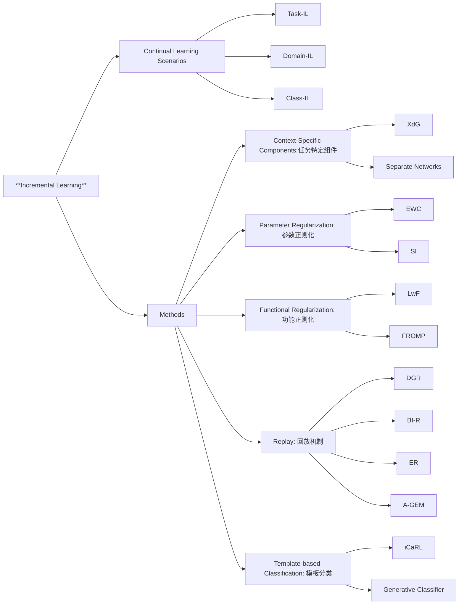

# [Three types of incremental learning](https://www.nature.com/articles/s42256-022-00568-3)

---

---

# 增量学习

---

# 核心要点

## 1. Continual Learning（持续学习）
- **定义**: 持续学习是一种从非平稳数据流中逐步学习新信息的能力。
- **挑战**: 深度神经网络容易遗忘已学到的知识，称为“灾难性遗忘”。
- **目标**: 缩小人工智能与自然智能之间在增量学习能力方面的差距。
- **应用领域**: 医疗诊断、自动驾驶、金融市场预测等。

## 2. 三种持续学习场景  $\textcolor{red}{头T-等D-舱C }$ 

任务增量、域增量和类增量是指在模型学习过程中逐步增加不同类型的信息或数据。这些概念主要用于解决机器学习模型在面对新数据时保持性能稳定的问题

### 2.1 Task-Incremental Learning (Task-IL)
- **定义**: 算法必须逐步学习一组明确可区分的任务，并且在测试时任务的身份是已知的。
- **解释**: 任务增量学习指的是模型在不同的时间段学习不同的任务，每个任务的数据和目标可能完全不同。模型需要在学习新任务时不忘记之前学过的任务。
- **例子**: 想象一个机器人，它先学会了扫地（任务1），然后学会了擦窗（任务2），最后学会了洗衣服（任务3）。每个任务都是独立的，机器人需要在学会新任务时，不忘记之前学过的任务。
- **挑战**: 共享表示、计算复杂度优化、正向或反向迁移学习。
- **示例**: 学习不同的运动或乐器。
  
### 2.2 Domain-Incremental Learning (Domain-IL)
- **定义**: 算法需要在相同问题的不同上下文中进行学习，测试时任务身份未知。
- **解释**: 域增量学习是指模型在不同时间段学习相同任务，但在不同的领域或环境中。这里的领域指的是数据的分布不同，但任务本身没有改变。
- **例子**: 假设一个垃圾分类系统，首先在家庭环境中训练（域1），然后在办公室环境中训练（域2），最后在公园环境中训练（域3）。垃圾分类的任务是一致的，但环境变化了，系统需要适应不同环境下的数据分布。
- **挑战**: 输入分布随时间变化，不允许任务特定组件。
- **示例**: 识别不同照明条件下的对象、不同天气下的驾驶。
  
### 2.3 Class-Incremental Learning (Class-IL)
- **定义**: 算法必须逐步学习识别不断增加的对象或类别数量。
- **解释**: 类增量学习是指模型逐步学习新的类别，之前学过的类别数据不再提供。模型需要在学习新类别的同时，保持对旧类别的识别能力。
- **例子**: 假设一个图像识别系统，最开始它只学会了识别猫（类别1），接着学会了识别狗（类别2），最后学会了识别鸟（类别3）。每次增加新类别时，系统需要在不忘记之前学过的类别的情况下，正确识别所有类别。
- **挑战**: 在训练过程中不同时观察到的类别之间进行区分。
- **示例**: 学习区分不同动物类别。
  
> #### 区别总结
> - **任务增量学习 Task-IL**：不同时间段学习完全不同的任务。
> - **域增量学习 Domain-IL**：相同任务在不同领域或环境中进行学习。
> - **类增量学习 Class-IL**：逐步学习新的类别，保持对旧类别的识别能力。

## 3. 类增量 Class-IL 和 任务增量 Task-IL 的区别

类增量学习和任务增量学习虽然都涉及逐步学习新的信息，但它们的核心区别在于**学习内容的性质**以及**任务定义**的不同。

### 3.1 类增量学习 (Class Incremental Learning)
类增量学习是指模型在相同任务下逐步学习新的类别。模型在学习新类别时，需要保持对先前已学习类别的识别能力。任务本质上是相同的，但类别增加了。

**例子**：
一个图像分类系统开始时只学习识别猫，然后逐步增加识别狗、鸟等新类别。任务始终是图像分类，只是分类的类别增加了。

### 3.2 任务增量学习 (Task Incremental Learning)
任务增量学习是指模型在不同时间段学习完全不同的任务。这些任务的目标、数据分布和特征可能完全不同。模型需要在学习新任务时，不忘记之前学过的不同任务。

**例子**：
一个多功能机器人，首先学习扫地，然后学习擦窗，最后学习洗衣服。这些任务的目标和操作方式都不同，机器人需要在学会新任务的同时，不忘记之前学过的不同任务。

### 区别总结
1. **任务定义**：
   - **类增量学习**：任务本质上是相同的（例如，都属于图像分类任务），只是分类的类别在增加。
   - **任务增量学习**：任务本身在不断变化（例如，从扫地到擦窗再到洗衣服），每个任务的目标和操作方式都不同。

2. **学习内容**：
   - **类增量学习**：学习新的类别，并保持对旧类别的识别能力。类别增加，但任务不变。
   - **任务增量学习**：学习新的任务，并保持对旧任务的执行能力。任务本身变化，目标和数据分布可能完全不同。

3. **模型适应性**：
   - **类增量学习**：模型需要适应新的类别，同时不忘记旧类别。在同一任务框架下不断扩展知识。
   - **任务增量学习**：模型需要适应完全不同的任务，每个任务的要求和数据特征可能完全不同，模型需要在不同任务之间切换。

## 4. 实验比较与结果

**实验场景**: 使用了 Split MNIST 和 Split CIFAR-100 进行对比实验。

**比较方法**:
  - **Context-Specific Components (任务特定组件)**
    - 针对每个上下文使用不同的网络部分
    - 例如: XdG, Separate Networks
  - **Parameter Regularization (参数正则化)**
    - 限制对关键参数的更改
    - 例如: EWC, SI
  - **Functional Regularization (功能正则化)**
    - 在锚点上保持输入输出映射
    - 例如: LwF, FROMP
  - **Replay (回放机制)**
    - 通过回放过去数据代表当前学习过程
    - 例如: DGR, BI-R, ER, A-GEM
  - **Template-based Classification (模板分类)**
    - 学习每个类的模板，并基于最适合样本的模板进行分类
    - 例如: iCaRL, Generative Classifier

**实验结果总结**:
  - **Task-IL** > **Domain-IL** > **Class-IL** 难度依次增加。
  - **Parameter Regularization** 在 Task-IL 表现良好，但在 Class-IL 失败。
  - **Replay**方法 在所有场景中表现良好，特别是在 Class-IL 中。

---

# 精读笔记

## 1. Situation / Background - 论文场景与背景

**背景**: 增量学习（incremental learning）是指模型在不断变化的数据流中逐步学习新信息的能力。这种能力是自然智能的核心特点，但对于深度神经网络来说却是一个挑战。研究人员提出了许多深度学习方法来应对这个问题，但由于缺乏统一的框架，不同方法的性能比较存在困难。论文旨在解决这一问题，并提出三种基本的增量学习场景：任务增量（task-incremental）、领域增量（domain-incremental）和类别增量（class-incremental）学习。每个场景都有其特定的挑战。

**Background**: Incremental learning refers to the ability of models to learn new information from a non-stationary data stream continuously, a key feature of natural intelligence but a challenging problem for deep neural networks. Numerous deep learning methods have been proposed to tackle this, but comparing their performance is difficult due to the lack of a common framework. The paper addresses this issue by proposing three fundamental types of incremental learning scenarios: task-incremental, domain-incremental, and class-incremental learning, each with its own set of challenges.

## 2. Tasks - 研究目的与挑战

**研究目的**: 本文的目的是明确定义和比较三种增量学习场景的性能，并探讨不同的深度学习策略在这些场景中的适用性。通过在Split MNIST和Split CIFAR-100协议上进行实验比较，研究不同策略在各个增量学习场景中的表现。目标是为持续学习领域构建一个更具结构性的框架，解决深度神经网络在非静态数据流中的灾难性遗忘问题。

**挑战**: 主要挑战包括：
- **任务增量学习**：算法必须逐步学习一系列明确区分的任务，且算法在测试时知道当前的任务。
- **领域增量学习**：算法需要在不同的上下文中解决相同的问题，而测试时任务身份未知。
- **类别增量学习**：算法需要区分逐渐增多的对象或类别，且不同类别不同时出现，深度神经网络容易遭遇灾难性遗忘。

**Objective**: The goal is to define and compare the performance of three incremental learning scenarios and investigate the applicability of various deep learning strategies across these scenarios. By conducting empirical comparisons using the Split MNIST and Split CIFAR-100 protocols, the study aims to provide a structured framework for continual learning and tackle the challenge of catastrophic forgetting in deep neural networks.

**Challenges**:
- **Task-Incremental Learning**: The challenge is that the algorithm must incrementally learn clearly distinguishable tasks, with task identity known at test time.
- **Domain-Incremental Learning**: The algorithm needs to solve the same problem across different contexts without knowing the task at test time.
- **Class-Incremental Learning**: The algorithm must learn to discriminate between an increasing number of classes, but without encountering them simultaneously, which poses a risk of catastrophic forgetting for deep neural networks.

## 3. Actions - 研究方法与策略比较

**研究方法**: 本文对不同增量学习策略进行了分类和比较，包括上下文特定组件、参数正则化、功能正则化、重放方法和模板分类方法。为每个策略选择了代表性方法，并在 Split MNIST 和 Split CIFAR-100 协议下进行了实验。

- **上下文特定组件**: 使用任务特定的输出层，如XdG和单独的网络。
- **参数正则化**: 例如弹性权重整合（EWC）和突触智能（SI），这些方法通过对参数施加正则化来减少灾难性遗忘。
- **功能正则化**: 例如LwF和FROMP，通过保留某些输入输出映射来减轻遗忘。
- **重放方法**: 如DGR和ER，利用之前见过的样本进行重放，减少遗忘。
- **模板分类方法**: 如iCaRL，通过模板学习来增强类别区分能力。

**Actions**: The study categorizes and compares various incremental learning strategies, including context-specific components, parameter regularization, functional regularization, replay methods, and template-based classification. A representative method was selected for each strategy, and experiments were conducted using the Split MNIST and Split CIFAR-100 protocols.

- **Context-Specific Components**: Using task-specific output layers like XdG and Separate Networks.
- **Parameter Regularization**: Techniques like Elastic Weight Consolidation (EWC) and Synaptic Intelligence (SI), which reduce catastrophic forgetting by regularizing important parameters.
- **Functional Regularization**: Learning without Forgetting (LwF) and FROMP reduce forgetting by preserving certain input-output mappings.
- **Replay Methods**: Deep Generative Replay (DGR) and Experience Replay (ER) mitigate forgetting by replaying previously seen samples.
- **Template-Based Classification**: Methods like iCaRL improve class discrimination by learning templates for each class.

## 4. Results - 实验比较与结果

**实验结果**: 实验显示，不同的增量学习场景在难度和策略有效性方面存在显著差异。任务增量学习场景中，大多数方法表现优异，尤其是重放方法在所有场景中的表现都较好。对于类别增量学习，参数正则化方法表现较差，而重放方法和模板分类方法表现较好。

- **任务增量学习**: 大多数策略在这一场景下表现优异。
- **领域增量学习**: 参数正则化方法的性能显著下降，重放方法的表现相对较好。
- **类别增量学习**: 参数正则化方法几乎完全失效，而使用存储数据的重放方法和模板分类方法表现较好。

**Results**: The experiments reveal significant differences between the incremental learning scenarios in terms of difficulty and the effectiveness of strategies. In task-incremental learning, most methods performed well, with replay-based methods being top performers across all scenarios. For class-incremental learning, parameter regularization methods failed, while replay and template-based methods performed best.

- **Task-Incremental Learning**: Most strategies performed exceptionally well in this scenario.
- **Domain-Incremental Learning**: Performance of parameter regularization methods dropped significantly, while replay methods performed relatively well.
- **Class-Incremental Learning**: Parameter regularization methods almost completely failed, but replay methods and template-based classification performed well.

## 5. Future - 未来展望与建议

**未来展望**: 论文建议进一步优化重放方法，尤其是结合生成模型与存储数据的方法。此外，领域增量学习场景的研究尚不充分，未来需要更多针对现实问题的场景，如在不同的照明或天气条件下训练模型。对于类别增量学习，参数正则化方法需要新的方向，例如通过引入更多上下文信息来增强对未同时出现类别的区分。

**Future**: The paper suggests further optimizing replay methods, especially those combining generative models with stored data. The domain-incremental learning scenario is underexplored, and future work should focus on more realistic contexts, such as training models in varying lighting or weather conditions. For class-incremental learning, parameter regularization methods need new approaches, possibly by incorporating more context information to better discriminate between classes not observed together.

