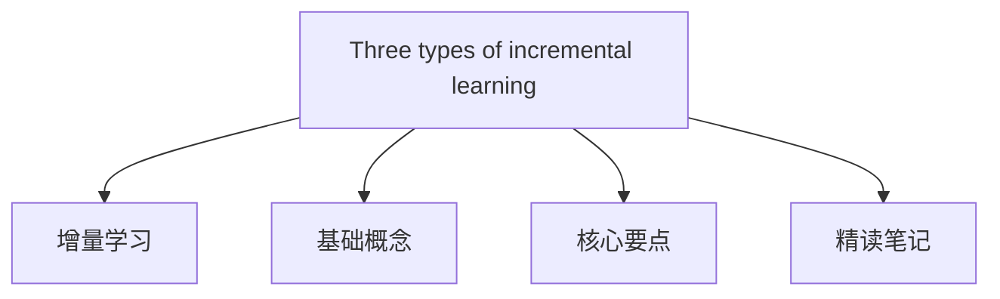

#  [Three scenarios for continual learning](https://arxiv.org/abs/1904.07734)

---

## 目录大纲

## 核心要点

### 1. **Situation / Background - 论文场景与背景**

- **Continual Learning** 是在神经网络中实现终身学习的重要问题，现有神经网络在训练新任务时容易忘记先前的任务，这种现象被称为“灾难性遗忘”。
- 尽管已经提出了许多方法来缓解这一问题，但由于不同的实验评估标准，比较其性能具有挑战性。
- 本文提出了三种不同的持续学习场景：任务增量学习 (Task-IL)、领域增量学习 (Domain-IL) 和类别增量学习 (Class-IL)，它们根据测试时是否提供任务标识以及是否要求模型推断任务类别来进行区分。

### 2. **Tasks - 研究目的与挑战**
- **Research Goal**: The main objective is to create a standardized evaluation framework for continual learning methods, by categorizing learning scenarios based on task identity and difficulty. This facilitates the comparison of different methods for addressing catastrophic forgetting.
- **Challenges**:
  1. Dealing with catastrophic forgetting while sequentially learning tasks.
  2. Finding methods that work across different scenarios, especially in more challenging ones like Class-IL where task identity is not provided and must be inferred.

  ---
  - **研究目标**：提出一个标准化的评估框架，将持续学习场景基于任务标识和难度进行分类，以便更好地比较不同的方法如何应对灾难性遗忘。
  - **挑战**：
    1. 如何在连续学习任务时处理灾难性遗忘。
    2. 在更具挑战性的场景中，如Class-IL场景中，任务标识未提供且需要推断时，寻找能够有效应对的方法。

### 3. **Actions - 研究方法与策略比较**
- **Methodology**: The paper compares different continual learning strategies across the three scenarios (Task-IL, Domain-IL, Class-IL) using the Split and Permuted MNIST task protocols.
  - **Task-IL**: Task identity is provided during testing, and task-specific components can be used.
  - **Domain-IL**: Task identity is not given, but the model only needs to solve the task without identifying it.
  - **Class-IL**: Task identity is not given, and the model needs to infer both the task and solve it.
- **Strategies**:
  1. **Task-specific components**: Different parts of the network are used for different tasks, but this works only for Task-IL scenarios.
  2. **Regularized optimization**: Methods like Elastic Weight Consolidation (EWC) that regularize the model's parameters to prevent forgetting.
  3. **Replay-based methods**: Replay methods generate or store past task data for retraining, including deep generative replay (DGR) and Learning without Forgetting (LwF).

  - **研究方法**：本文基于Split MNIST和Permuted MNIST任务协议，比较了三种不同持续学习场景中的学习策略。
    - **Task-IL**：测试时提供任务标识，可以使用任务特定的组件。
    - **Domain-IL**：任务标识未提供，但模型只需解决任务，无需识别。
    - **Class-IL**：任务标识未提供，模型既需要推断任务也需完成任务。
  - **策略**：
    1. **任务特定组件**：不同任务使用网络的不同部分，但只适用于Task-IL场景。
    2. **正则化优化**：如EWC，通过正则化模型参数防止遗忘。
    3. **重放方法**：如深度生成重放（DGR）和不遗忘学习（LwF），通过生成或存储过去的任务数据进行重新训练。

### 4. **Results - 实验比较与结果**
- **Experimental Protocols**: Experiments were conducted using both Split MNIST and Permuted MNIST protocols to evaluate different methods under the three scenarios.
  - **Task-IL**: All methods performed well, with Elastic Weight Consolidation (EWC) and Deep Generative Replay (DGR) being effective.
  - **Domain-IL**: Regularization-based methods performed poorly compared to replay-based methods like DGR.
  - **Class-IL**: Regularization-based methods completely failed, while replay-based methods, particularly DGR+distillation and iCaRL, performed best.
- **Key Findings**:
  1. Replay-based methods outperform regularization-based methods, especially in more challenging scenarios like Domain-IL and Class-IL.
  2. Task-specific methods work best in Task-IL but fail in other scenarios.
     
  - **实验协议**：实验使用Split MNIST和Permuted MNIST协议评估了三种场景下不同方法的表现。
    - **Task-IL**：所有方法表现良好，EWC和DGR较为有效。
    - **Domain-IL**：与重放方法相比，基于正则化的方法表现较差。
    - **Class-IL**：基于正则化的方法完全失败，而重放方法（特别是DGR+蒸馏和iCaRL）表现最佳。
  - **主要发现**：
    1. 重放方法在更具挑战性的场景（如Domain-IL和Class-IL）中优于正则化方法。
    2. 任务特定的方法在Task-IL中表现最好，但在其他场景中失败。

### 5. **Future - 未来展望与建议**
- **Future Directions**:
  1. **Replay Methods**: Given that replay-based methods outperform others, improving generative models to replay complex tasks and input distributions will be crucial.
  2. **Scalability**: There is a need to test the scalability of these methods on more complex datasets beyond MNIST.
  3. **Alternative Approaches**: Storing exemplar data and hybrid strategies combining regularization and replay might be promising avenues.
- **Suggestions**:
  - Future research should focus on improving replay techniques for more complex input distributions and explore combining replay with other methods for enhanced performance.

  - **未来方向**：
    1. **重放方法**：鉴于重放方法的优势，未来需提高生成模型的能力，以便处理更复杂的任务和输入分布。
    2. **可扩展性**：有必要在更复杂的数据集上测试这些方法的可扩展性。
    3. **替代方法**：存储样本数据以及结合正则化与重放的混合策略可能是未来的潜在方向。
  - **建议**：
    - 未来研究应专注于改进适用于更复杂输入分布的重放技术，并探索重放与其他方法结合的可能性，以提高性能。
   
---

