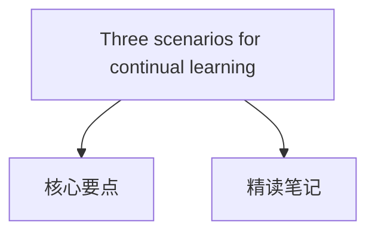

#  [Three scenarios for continual learning](https://arxiv.org/abs/1904.07734)

---

## 目录大纲

----

## 核心要点

### 实验比较与结果总结

#### **1. 实验协议**

实验基于两种数据集：**Split MNIST**和**Permuted MNIST**，评估了不同持续学习方法在三种场景（Task-IL、Domain-IL、Class-IL）中的表现。
- **Split MNIST**：将MNIST数据集分成5个二分类任务。
- **Permuted MNIST**：对MNIST数据集应用像素置换生成10个不同的任务。

#### **2. 主要发现**
- **重放方法表现最佳**：
  - **DGR（Deep Generative Replay）** 和 **DGR+distill** 在所有场景中表现出色，尤其在更具挑战性的Class-IL场景中，准确率超过90%。
  - **iCaRL** 在Class-IL场景中也表现出色，准确率达到94.57%。
- **正则化方法效果有限**：
  - 方法如Elastic Weight Consolidation (EWC)和Synaptic Intelligence (SI)在Task-IL场景中表现较好，但在Domain-IL和Class-IL场景中效果显著下降，尤其在Class-IL场景中，准确率低于25%。
- **任务特定组件方法**：在Task-IL场景中效果良好，但在其他场景中无法应用。

#### **3. 数据展示**
- **Task-IL场景**：所有方法表现较好，DGR+distill的准确率最高，达到了99.61%。
- **Domain-IL场景**：重放方法明显优于正则化方法，DGR+distill准确率为96.83%，而EWC仅为63.95%。
- **Class-IL场景**：只有重放方法能够有效应对，DGR+distill准确率达到91.79%，正则化方法几乎完全失败。

#### **4. 统计显著性**
- 实验结果经过20次重复实验，确保了结果的可靠性，重放方法与正则化方法之间的性能差异在各场景中都具有统计显著性。

#### **结论**
- **重放方法**是应对灾难性遗忘的最有效策略，特别适用于任务身份需要推断的Class-IL场景。
- 正则化方法只能在任务身份明确的情况下（Task-IL）发挥作用，在更复杂的场景中表现不佳。

这表明**重放策略**在持续学习中具有重要优势，尤其是在面对复杂、现实应用中的任务时。

---

## 精读笔记

## 1. **Situation / Background - 论文场景与背景**

- **Continual Learning** 是在神经网络中实现终身学习的重要问题，现有神经网络在训练新任务时容易忘记先前的任务，这种现象被称为“灾难性遗忘”。
- 尽管已经提出了许多方法来缓解这一问题，但由于不同的实验评估标准，比较其性能具有挑战性。
- 本文提出了三种不同的持续学习场景：**任务增量学习 (Task-IL)**、**领域增量学习 (Domain-IL)** 和**类别增量学习 (Class-IL)**，它们根据测试时是否提供任务标识以及是否要求模型推断任务类别来进行区分。

## 2. **Tasks - 研究目的与挑战**

- **研究目标**：提出一个标准化的评估框架，将持续学习场景基于任务标识和难度进行分类，以便更好地比较不同的方法如何应对灾难性遗忘。
- **挑战**：
  1. 如何在连续学习任务时处理灾难性遗忘。
  2. 在更具挑战性的场景中，如Class-IL场景中，任务标识未提供且需要推断时，寻找能够有效应对的方法。

## 3. **Actions - 研究方法与策略比较**

- **研究方法**：本文基于 Split MNIST 和 Permuted MNIST 任务协议，比较了三种不同持续学习场景中的学习策略。
  1. **Task-IL**：测试时提供任务标识，可以使用任务特定的组件。
  2. **Domain-IL**：任务标识未提供，但模型只需解决任务，无需识别。
  3. **Class-IL**：任务标识未提供，模型既需要推断任务也需完成任务。
- **策略**：
  1. **任务特定组件** **Task-specific components**：不同任务使用网络的不同部分，但只适用于 Task-IL 场景。
  2. **正则化优化** **Regularized optimization**：如 EWC，通过正则化模型参数防止遗忘。
  3. **重放方法** **Replay-based methods**：如深度生成重放（DGR）和不遗忘学习（LwF），通过生成或存储过去的任务数据进行重新训练。

## 4. **Results - 实验比较与结果**

- **实验协议**：实验使用 Split MNIST 和 Permuted MNIST 协议评估了三种场景下不同方法的表现。
  1. **Task-IL**：所有方法表现良好，EWC 和 DGR 较为有效。
  2. **Domain-IL**：与重放方法(DGR)相比，基于正则化的方法表现较差。
  3. **Class-IL**：基于正则化的方法完全失败，而重放方法（特别是 DGR + distillation 和 iCaRL）表现最佳。
- **主要发现**：
  1. 重放方法在更具挑战性的场景（如 Domain-IL 和 Class-IL）中优于正则化方法。
  2. 任务特定的方法在Task-IL中表现最好，但在其他场景中失败。

## 5. **Future - 未来展望与建议**

- **未来方向**：
  1. **重放方法**：鉴于重放方法的优势，未来需提高生成模型的能力，以便处理更复杂的任务和输入分布。
  2. **可扩展性**：有必要在更复杂的数据集上测试这些方法的可扩展性。
  3. **替代方法**：存储样本数据以及结合正则化与重放的混合策略可能是未来的潜在方向。
- **建议**：
  - 未来研究应专注于改进适用于更复杂输入分布的重放技术，并探索重放与其他方法结合的可能性，以提高性能。

