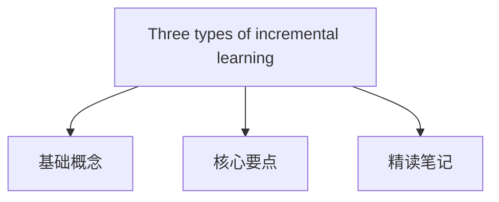

#  [Three scenarios for continual learning](https://arxiv.org/abs/1904.07734)

---

## 目录大纲

## 核心要点

## 1. **Situation / Background - 论文场景与背景**

- **Continual Learning** 是在神经网络中实现终身学习的重要问题，现有神经网络在训练新任务时容易忘记先前的任务，这种现象被称为“灾难性遗忘”。
- 尽管已经提出了许多方法来缓解这一问题，但由于不同的实验评估标准，比较其性能具有挑战性。
- 本文提出了三种不同的持续学习场景：**任务增量学习 (Task-IL)**、**领域增量学习 (Domain-IL)** 和**类别增量学习 (Class-IL)**，它们根据测试时是否提供任务标识以及是否要求模型推断任务类别来进行区分。

## 2. **Tasks - 研究目的与挑战**

- **研究目标**：提出一个标准化的评估框架，将持续学习场景基于任务标识和难度进行分类，以便更好地比较不同的方法如何应对灾难性遗忘。
- **挑战**：
  1. 如何在连续学习任务时处理灾难性遗忘。
  2. 在更具挑战性的场景中，如Class-IL场景中，任务标识未提供且需要推断时，寻找能够有效应对的方法。

## 3. **Actions - 研究方法与策略比较**

- **研究方法**：本文基于 Split MNIST 和 Permuted MNIST 任务协议，比较了三种不同持续学习场景中的学习策略。
  1. **Task-IL**：测试时提供任务标识，可以使用任务特定的组件。
  2. **Domain-IL**：任务标识未提供，但模型只需解决任务，无需识别。
  3. **Class-IL**：任务标识未提供，模型既需要推断任务也需完成任务。
- **策略**：
  1. **任务特定组件** **Task-specific components**：不同任务使用网络的不同部分，但只适用于 Task-IL 场景。
  2. **正则化优化** **Regularized optimization**：如 EWC，通过正则化模型参数防止遗忘。
  3. **重放方法** **Replay-based methods**：如深度生成重放（DGR）和不遗忘学习（LwF），通过生成或存储过去的任务数据进行重新训练。

## 4. **Results - 实验比较与结果**

- **实验协议**：实验使用 Split MNIST 和 Permuted MNIST 协议评估了三种场景下不同方法的表现。
  1. **Task-IL**：所有方法表现良好，EWC 和 DGR 较为有效。
  2. **Domain-IL**：与重放方法(DGR)相比，基于正则化的方法表现较差。
  3. **Class-IL**：基于正则化的方法完全失败，而重放方法（特别是 DGR + distillation 和 iCaRL）表现最佳。
- **主要发现**：
  1. 重放方法在更具挑战性的场景（如 Domain-IL 和 Class-IL）中优于正则化方法。
  2. 任务特定的方法在Task-IL中表现最好，但在其他场景中失败。

## 5. **Future - 未来展望与建议**

- **未来方向**：
  1. **重放方法**：鉴于重放方法的优势，未来需提高生成模型的能力，以便处理更复杂的任务和输入分布。
  2. **可扩展性**：有必要在更复杂的数据集上测试这些方法的可扩展性。
  3. **替代方法**：存储样本数据以及结合正则化与重放的混合策略可能是未来的潜在方向。
- **建议**：
  - 未来研究应专注于改进适用于更复杂输入分布的重放技术，并探索重放与其他方法结合的可能性，以提高性能。
   
---

## 精读笔记

## 1. **Motivation / 研究动机**

**Primary Research Question**:  
The primary research question is how to effectively mitigate catastrophic forgetting in neural networks when learning tasks sequentially. Specifically, the study aims to evaluate different methods for continual learning by proposing three scenarios (Task-IL, Domain-IL, and Class-IL) and identifying which methods are most effective under each scenario.

**主要研究问题**：  
研究的主要问题是如何有效缓解神经网络在顺序学习任务时的灾难性遗忘。研究通过提出三种场景（Task-IL、Domain-IL和Class-IL）来评估不同的持续学习方法，并确定在每个场景下最有效的方法。

**Significance of the Study**:  
This research is significant because continual learning is crucial for developing AI that can adapt over time without forgetting past knowledge. In the context of Deep Learning, Time Series Incremental Learning, and Continual Incremental Learning, this study addresses key challenges in enabling AI systems to learn from ongoing data streams while retaining prior knowledge. The findings could impact real-world applications where lifelong learning is essential, such as robotics, autonomous driving, and healthcare.

**研究的重要性**：  
该研究的重要性在于，持续学习对于开发能够在时间推移中适应而不遗忘过去知识的人工智能至关重要。在深度学习、时间序列增量学习和持续增量学习的背景下，这项研究解决了使AI系统能够在保持先前知识的同时从持续数据流中学习的关键挑战。其研究结果可能对机器人、自动驾驶和医疗等需要终身学习的实际应用产生重大影响。

**Existing Knowledge Gaps**:  
The current gap in knowledge lies in the lack of standardized evaluation protocols for continual learning methods and in the mixed results obtained from different methods across varying experimental settings. Many methods fail when task identity must be inferred, and replay-based approaches are often underexplored. This study aims to fill these gaps by standardizing evaluation through three distinct continual learning scenarios and comparing the effectiveness of different strategies.

**现有知识空白**：  
当前知识中的空白在于缺乏对持续学习方法的标准化评估协议，并且在不同实验设置中，不同方法的结果表现不一。许多方法在任务身份需要推断时失败，重放方法也往往没有得到充分探索。该研究通过提出三种不同的持续学习场景来填补这些空白，并比较不同策略的有效性。

## 2. **Approach/Methods / 方法**

**Detailed Methodology**:  
The authors used three continual learning scenarios—Task-IL, Domain-IL, and Class-IL—as the framework for their study. They employed methods such as Elastic Weight Consolidation (EWC), Synaptic Intelligence (SI), and replay-based methods like Deep Generative Replay (DGR). Each method was evaluated on its ability to prevent catastrophic forgetting across these scenarios using well-known task protocols like Split MNIST and Permuted MNIST. Notably, replay-based methods, which either replay stored data or generate data to simulate previous tasks, are innovative for mitigating forgetting.

**详细方法**：  
作者使用了三种持续学习场景——Task-IL、Domain-IL和Class-IL——作为研究框架。研究中使用的方法包括弹性权重整合（EWC）、突触智能（SI）以及基于重放的方法如深度生成重放（DGR）。每种方法在使用Split MNIST和Permuted MNIST等任务协议中评估其防止灾难性遗忘的能力。尤其是基于重放的方法，通过重放存储数据或生成模拟以前任务的数据，是缓解遗忘的创新性方法。

**Experimental Design and Data Collection**:  
The experiments were designed using the Split MNIST and Permuted MNIST datasets. The Split MNIST protocol divides the MNIST dataset into several binary classification tasks, while Permuted MNIST introduces pixel permutations to create new tasks. The data collection involved training the neural network incrementally on these tasks. The design is well-suited to address the research question, as the varying difficulty levels of the scenarios (Task-IL, Domain-IL, Class-IL) provide a comprehensive evaluation of the methods' effectiveness.

**实验设计和数据收集**：  
实验设计使用了Split MNIST和Permuted MNIST数据集。Split MNIST协议将MNIST数据集分成多个二分类任务，Permuted MNIST通过像素置换创建新的任务。数据收集涉及逐步在这些任务上训练神经网络。由于不同场景（Task-IL、Domain-IL、Class-IL）的难度水平变化，此设计非常适合解决研究问题，并对方法的有效性进行了全面评估。

## 3. **Context within the Field / 领域内的背景**

**Relation to Existing Research**:  
The authors' methods build upon previous work in catastrophic forgetting, such as Kirkpatrick's Elastic Weight Consolidation and generative replay techniques. While prior studies often evaluated methods in isolation or under different protocols, this research contributes a standardized comparison across three scenarios. This study fits within the growing body of work aimed at creating lifelong learning systems but pushes the field further by offering clearer benchmarks for evaluating methods under varying levels of task difficulty.

**与现有研究的关系**：  
作者的方法基于之前的灾难性遗忘研究，例如Kirkpatrick提出的弹性权重整合和生成重放技术。以往研究往往是单独评估方法或在不同的协议下进行，而该研究通过标准化的比较提供了三个不同场景下的评估。这项研究融入了旨在创建终身学习系统的不断增长的研究体系中，并通过提供更清晰的基准来推动该领域的发展。

**Rationale for Methodology**:  
The choice of using three distinct continual learning scenarios is justified by the need to evaluate methods under both ideal (Task-IL) and challenging (Class-IL) conditions. Previous research focused mainly on simpler tasks where task identity is provided, but in real-world applications, this is rarely the case. The authors draw on existing frameworks and enhance them by introducing the difficulty gradient across the three scenarios. Replay-based approaches were chosen for their potential to overcome the weaknesses of regularization methods, as evidenced in prior studies.

**方法选择的理由**：  
选择三种不同的持续学习场景的理由是需要在理想（Task-IL）和具有挑战性（Class-IL）的条件下评估方法。之前的研究主要集中在任务标识提供的简单任务上，但在现实应用中，这种情况很少发生。作者借鉴了现有框架，并通过引入三个场景的难度梯度进行了改进。选择基于重放的方法是因为它们有可能克服正则化方法的弱点，正如先前研究所表明的那样。

## 4. **Results / 结果**

**Summary of Key Findings**:  
The main findings show that replay-based methods, particularly Deep Generative Replay (DGR) and DGR+distill, are the most effective at mitigating catastrophic forgetting, especially in the Class-IL scenario where task identity must be inferred. Regularization-based methods like Elastic Weight Consolidation (EWC) perform well in the Task-IL scenario but fail in the more challenging scenarios.

**主要发现的总结**：  
主要发现表明，基于重放的方法，特别是深度生成重放（DGR）和DGR+蒸馏，在缓解灾难性遗忘方面最为有效，特别是在Class-IL场景中，任务标识需要推断。基于正则化的方法如EWC在Task-IL场景中表现良好，但在更具挑战性的场景中表现不佳。

**Presentation of Data**:  
The key data is presented in tables showing the average test accuracy across tasks in different scenarios. For example, in the split MNIST task, replay-based methods consistently achieve above 90% accuracy in the Class-IL scenario, whereas regularization methods fall below 25%. These results highlight the importance of replay strategies, especially in complex task sequences where task identities must be inferred.

**数据展示**：  
关键数据以表格形式呈现，显示了不同场景中任务的平均测试准确率。例如，在Split MNIST任务中，基于重放的方法在Class-IL场景中持续达到90%以上的准确率，而正则化方法低于25%。这些结果突显了重放策略的重要性，尤其是在任务身份需要推断的复杂任务序列中。

**Statistical Significance**:  
The results are statistically significant, with repeated experiments (20 runs per method) to ensure consistency. The comparison of methods uses standard metrics such as test accuracy, and the findings show clear differences in performance across scenarios, supporting the validity of the conclusions.

**统计显著性**：  
结果具有统计显著性，通过多次重复实验（每种方法20次运行）确保一致性。方法的比较使用了标准指标如测试准确率，结果显示了不同场景下性能的明显差异，支持了结论的有效性。

## 5. **Interpretation/Discussion / 结果解释/讨论**

**Authors' Conclusions**:  
The authors conclude that replay-based methods are necessary for tackling more complex continual learning scenarios, such as Class-IL. Regularization-based approaches are insufficient for scenarios where task identity must be inferred. The study emphasizes the need for future research to focus on improving generative models for more complex tasks.

**作者的结论**：  
作者总结认为，重放方法在解决更复杂的持续学习场景（如Class-IL）中是必要的。正则化方法在任务标识需要推断的场景中不足。研究强调未来应致力于为更复杂任务改进生成模型。

**Implications and Applications**:  
The implications for Deep Learning, Time Series Incremental Learning, and Continual Incremental Learning are significant. Replay-based methods could be applied in autonomous systems, robotics, and other fields requiring lifelong learning capabilities. For instance, autonomous vehicles could use replay strategies to adapt to new environments while retaining previously learned knowledge.

**结果的影响和应用**：  
对于深度学习、时间序列增量学习和持续增量学习的影响重大。重放方法可应用于需要终身学习能力的自主系统、机器人等领域。例如，自动驾驶车辆可以使用重放策略适应新环境，同时保留先前学到的知识。

**Study Limitations**:  
The authors acknowledge that the study's limitation lies in its reliance on relatively simple datasets like MNIST. It remains uncertain how these methods would perform on more complex real-world data. Moreover, generative models may struggle with high-dimensional, complex input distributions.

**研究的局限性**：  
作者指出，研究的局限性在于依赖相对简单的数据集（如MNIST）。这些方法在更复杂的现实数据上表现如何尚不确定。此外，生成模型在处理高维、复杂输入分布时可能存在困难。

## 6. **Next Steps / 后续步骤**

**Future Research Directions**:  
The authors suggest future research should focus on testing these methods on more complex datasets and exploring hybrid strategies that combine regularization and replay. They also recommend improving the scalability of generative models.

**未来研究方向**：  
作者建议未来研究应侧重于在更复杂的数据集上测试这些方法，并探索结合正则化和重放的混合策略。此外，还应改进生成模型的可扩展性。

**Your Recommendations**:  
Based on this paper, additional research could explore applying replay-based methods to real-world continual learning challenges, such as autonomous navigation in dynamic environments. Further, investigating how these methods perform with multimodal data (e.g., audio-visual tasks) could provide insights into their versatility.

**您的建议**：  
基于本文，进一步研究可以探索将重放方法应用于现实中的持续学习挑战，例如动态环境中的自主导航。此外，研究这些方法在多模态数据（如视听任务）上的表现，可能对其多功能性提供新的见解。

