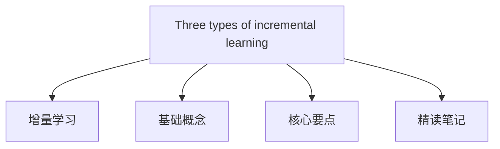

#  [Three scenarios for continual learning](https://arxiv.org/abs/1904.07734)

---

## 目录大纲

```mermaid
graph TD
    A[Three types of incremental learning] --> B[增量学习]
    A --> C[基础概念]
    A --> D[核心要点]
    A --> E[精读笔记]
```

---

